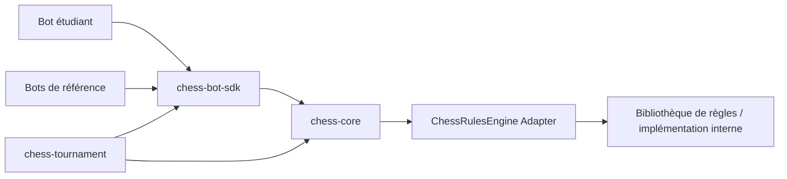

# Architecture cible

## 1. Ligne directrice

L'architecture sépare quatre préoccupations :

1. **jouer correctement aux échecs** ;
2. **analyser une position** ;
3. **décrire le comportement d'un bot** ;
4. **orchestrer des matchs et des tournois**.

Le code étudiant ne doit pas dépendre de la manière dont le moteur valide les coups.



---

## 2. Modules Maven

Structure cible :

```text
chess-framework/
├── pom.xml
├── chess-core/
├── chess-bot-sdk/
├── chess-bots/
├── chess-tournament/
└── docs/
```

### 2.1 chess-core

Responsabilités :

- modèle du jeu ;
- état d'une partie ;
- validation des coups ;
- historique ;
- conditions de fin ;
- adaptation d'un moteur de règles ;
- représentation FEN/PGN lorsque nécessaire.

Ce module ne contient aucune stratégie de bot.

### 2.2 chess-bot-sdk

Responsabilités :

- `ChessBot` ;
- `BotContext` ;
- `Rule` ;
- `Situation` ;
- `Detection` ;
- `Action` ;
- bibliothèque `Situations` ;
- bibliothèque `Actions` ;
- services d'analyse ;
- évaluateurs de position ;
- trace de décision.

C'est l'API principale utilisée par les étudiants.

### 2.3 chess-bots

Responsabilités :

- `RandomBot` ;
- `GreedyBot` ;
- `TacticalBot` ;
- espace destiné aux bots étudiants.

Ce module ne doit contenir aucune règle fondamentale du jeu.

### 2.4 chess-tournament

Responsabilités :

- lancement d'une partie ;
- tournoi ;
- appariements ;
- couleurs ;
- scoring ;
- timeout ;
- isolation progressive ;
- logs ;
- export PGN ;
- rapports.

---

## 3. Packages indicatifs

```text
fr.astroware.chess
├── core
│   ├── model
│   ├── game
│   ├── rules
│   └── notation
├── bot
│   ├── api
│   ├── rule
│   ├── situation
│   ├── action
│   ├── analysis
│   ├── evaluation
│   └── trace
├── bots
│   ├── baseline
│   └── students
└── tournament
    ├── match
    ├── pairing
    ├── scoring
    ├── isolation
    └── report
```

---

## 4. Modèle public

### 4.1 Objets valeur

Les types suivants doivent être petits, immuables et faciles à tester :

```java
public enum Color {
    WHITE, BLACK;

    public Color opposite() {
        return this == WHITE ? BLACK : WHITE;
    }
}
```

```java
public enum PieceType {
    PAWN, KNIGHT, BISHOP, ROOK, QUEEN, KING
}
```

```java
public record Piece(Color color, PieceType type) {}
```

```java
public record Square(File file, Rank rank) {}
```

```java
public record Move(
    Square from,
    Square to,
    Optional<PieceType> promotion
) {}
```

Les détails peuvent évoluer, mais le code étudiant doit manipuler les concepts des échecs plutôt que les classes d'une bibliothèque externe.

---

## 5. Position en lecture seule

Un bot ne reçoit jamais l'objet mutable réellement utilisé par le moteur.

Contrat conceptuel :

```java
public interface PositionView {

    Optional<Piece> pieceAt(Square square);

    List<PlacedPiece> pieces();

    List<PlacedPiece> pieces(Color color);

    Color sideToMove();

    Optional<Move> lastMove();

    String fen();
}
```

Les méthodes renvoyant des collections retournent des vues immuables.

---

## 6. BotContext

Le contexte d'un tour rassemble tout ce dont le bot a légitimement besoin.

```java
public interface BotContext {

    Color myColor();

    PositionView position();

    List<Move> legalMoves();

    Analysis analysis();

    PieceValues pieceValues();

    RandomGenerator random();
}
```

Évolutions possibles :

- temps restant ;
- numéro du coup ;
- historique public ;
- informations de tournoi autorisées.

Le contexte ne doit jamais exposer :

- l'instance du bot adverse ;
- ses règles ;
- son état privé ;
- un objet mutable du moteur.

---

## 7. ChessBot

`ChessBot` applique le pattern Template Method.

L'étudiant décrit essentiellement son identité et ses règles. Le framework contrôle l'algorithme général.

```java
public abstract class ChessBot {

    public abstract String name();

    protected abstract List<Rule<?>> rules();

    public final BotDecision decide(BotContext context) {
        // algorithme fourni par le framework
    }
}
```

Le `final` sur `decide` garantit que les bots simples respectent tous le même protocole.

Une API avancée pourra éventuellement être prévue plus tard pour autoriser des moteurs de recherche spécialisés, sans casser l'exercice principal.

---

### 7.1 Cycle de vie d'un bot

Une instance de bot appartient à une seule partie. Cela autorise un état interne sans fuite entre deux matchs.

```java
public abstract class ChessBot {

    public abstract String name();

    protected abstract List<Rule<?>> rules();

    protected void onGameStart(GameContext context) {}

    protected void onMovePlayed(GameEvent event) {}

    protected void onGameEnd(GameResult result) {}

    public final BotDecision decide(BotContext context) {
        // Template Method
    }
}
```

Le runner crée une nouvelle instance à chaque partie via `BotFactory`.

Un étudiant peut donc utiliser des champs privés typés pour mémoriser une cible, une phase ou une intention sans avoir besoin d'un stockage générique peu sûr.

### 7.2 Plans multi-coups

La V1 reste centrée sur les règles ordonnées. L'architecture réserve néanmoins une extension facultative :

```java
public interface Plan {

    String name();

    boolean isApplicable(BotContext context);

    Optional<Move> nextMove(BotContext context);

    boolean isCompleted(BotContext context);
}
```

Un plan n'est pas prioritaire pour la première livraison. Son rôle futur est de représenter une intention stratégique durable sans transformer `ChessBot` en machine à états codée en dur.

---

## 8. Detection

Une détection représente le résultat concret d'une situation.

```java
public interface Detection {
}
```

Exemples :

```java
public record HangingPieceDetection(
    PlacedPiece target,
    int attackers,
    int defenders
) implements Detection {}
```

```java
public record ForkDetection(
    Move move,
    PlacedPiece attacker,
    List<PlacedPiece> targets,
    int expectedGain
) implements Detection {}
```

```java
public record CheckDetection(
    Square kingSquare,
    List<PlacedPiece> attackers
) implements Detection {}
```

Cette approche évite de refaire l'analyse dans l'action.

---

## 9. Situation

Une situation est un détecteur.

Version cible :

```java
@FunctionalInterface
public interface Situation<D extends Detection> {

    List<D> detect(BotContext context);

    default boolean matches(BotContext context) {
        return !detect(context).isEmpty();
    }
}
```

Pourquoi retourner une liste :

- plusieurs pièces peuvent être pendues ;
- plusieurs fourchettes peuvent être disponibles ;
- plusieurs prises peuvent être candidates ;
- l'action peut ensuite choisir la meilleure occurrence.

Pour les situations binaires simples, le SDK fournira une détection légère interne.

---

## 10. Action

Une action transforme une ou plusieurs détections en proposition de coup.

```java
@FunctionalInterface
public interface Action<D extends Detection> {

    Optional<Move> choose(
        BotContext context,
        List<D> detections
    );
}
```

L'action :

- peut comparer plusieurs opportunités ;
- peut refuser de jouer ;
- ne peut pas forcer le moteur à accepter un coup illégal.

---

## 11. Rule

```java
public final class Rule<D extends Detection> {

    private final String name;
    private final Situation<D> situation;
    private final Action<D> action;

    public Rule(
        String name,
        Situation<D> situation,
        Action<D> action
    ) {
        this.name = Objects.requireNonNull(name);
        this.situation = Objects.requireNonNull(situation);
        this.action = Objects.requireNonNull(action);
    }

    // ...
}
```

Une API de construction expressive est souhaitée :

```java
rule("Fourchette",
     Situations.forkOpportunity(),
     Actions.playBestFork());
```

ou éventuellement :

```java
Rule.when(Situations.forkOpportunity())
    .named("Fourchette")
    .then(Actions.playBestFork());
```

La première forme est probablement préférable pour la V1 car elle reste simple.

---

## 12. Algorithme de décision

```java
for (Rule<?> rule : rules) {

    RuleAttempt attempt = rule.evaluate(context);

    trace.add(attempt);

    if (attempt.move().isEmpty()) {
        continue;
    }

    Move move = attempt.move().get();

    if (context.legalMoves().contains(move)) {
        return BotDecision.of(move, trace);
    }

    trace.markIllegal(move);
}

return fallbackDecision(context, trace);
```

En pratique, les génériques nécessiteront une encapsulation dans `Rule.evaluate` afin que `ChessBot` n'ait pas à effectuer de cast.

---

## 13. Composition des situations

Le framework doit proposer une API de Specification.

Exemples conceptuels :

```java
var valuableTarget =
    Situations.hangingEnemyPiece()
        .filter(d -> pieceValues.valueOf(d.target()) >= 5);
```

```java
var safeFork =
    Situations.forkOpportunity()
        .filter(fork -> analysis.isSafeAfter(fork.move()));
```

La composition doit préserver les données détectées lorsque cela est possible.

On évitera une API purement booléenne qui ferait perdre l'information tactique.

---

## 14. Analysis

`Analysis` constitue la façade d'analyse fournie à un bot.

```java
public interface Analysis {

    AttackMap attackMap();

    List<PlacedPiece> attackersOf(Square square, Color color);

    List<PlacedPiece> defendersOf(Square square, Color color);

    boolean isAttacked(Square square, Color byColor);

    boolean isDefended(Square square, Color byColor);

    int material(Color color);

    MaterialBalance materialBalance();

    List<Move> captures();

    PositionProjection after(Move move);

    // autres services...
}
```

L'objectif est de fournir des faits, pas de dicter la stratégie.

---

## 15. Projection d'un coup

De nombreux motifs nécessitent de répondre à :

> « Que se passe-t-il si je joue ce coup ? »

Le SDK doit fournir une projection en lecture seule.

Exemple :

```java
PositionProjection projection = context.analysis().after(move);

boolean queenStillSafe =
    !projection.analysis().isHanging(myQueen);
```

L'étudiant ne doit pas avoir à cloner ou muter manuellement le plateau.

---

## 16. AttackMap

L'AttackMap est une structure centrale.

Elle permet de répondre efficacement :

- quelles cases sont attaquées par les blancs ?
- par les noirs ?
- qui attaque e4 ?
- combien de défenseurs protège une pièce ?
- une destination est-elle dangereuse ?
- une pièce est-elle pendue ?

```java
public interface AttackMap {

    Set<Square> attackedBy(Color color);

    List<PlacedPiece> attackersOf(Square square, Color color);

    int attackCount(Square square, Color color);
}
```

Cette structure sera réutilisée par de nombreux détecteurs.

---

## 17. Évaluation

Pattern Strategy :

```java
@FunctionalInterface
public interface PositionEvaluator {
    double evaluate(PositionAnalysis position, Color perspective);
}
```

Composition :

```java
var evaluator = CompositeEvaluator.builder()
    .add(new MaterialEvaluator(), 1.0)
    .add(new MobilityEvaluator(), 0.1)
    .add(new KingSafetyEvaluator(), 0.4)
    .add(new CenterControlEvaluator(), 0.2)
    .build();
```

Les poids peuvent devenir une dimension intéressante du travail étudiant.

---

## 18. Explicabilité

Structures cibles :

```java
public record RuleAttempt(
    String ruleName,
    boolean matched,
    int detections,
    Optional<Move> proposedMove,
    AttemptStatus status,
    String explanation
) {}
```

```java
public record BotDecision(
    Move move,
    DecisionTrace trace
) {}
```

Statuts possibles :

- `NOT_MATCHED`
- `MATCHED_NO_MOVE`
- `ILLEGAL_PROPOSAL`
- `SELECTED`
- `ERROR`

---

## 19. Événements de partie

Observer :

```java
public interface GameListener {

    void onGameStarted(GameStarted event);

    void onMovePlayed(MovePlayed event);

    void onGameEnded(GameEnded event);
}
```

Usages :

- console ;
- PGN ;
- statistiques ;
- traces ;
- future interface graphique ;
- future visualisation web.

Le moteur de partie ne doit pas dépendre directement de ces sorties.

---

## 20. Backend des règles d'échecs

Le framework encapsule l'implémentation réelle derrière :

```java
public interface ChessRulesEngine {

    EnginePosition initialPosition();

    List<Move> legalMoves(EnginePosition position);

    EnginePosition apply(EnginePosition position, Move move);

    GameState gameState(EnginePosition position);

    String toFen(EnginePosition position);
}
```

Une implémentation `ChessRulesEngineAdapter` mappe les types internes de la bibliothèque sélectionnée vers notre modèle.

Critère fondamental : **aucune classe de la bibliothèque externe dans l'API étudiant**.

La bibliothèque finale sera choisie après un spike comparatif portant sur :

- correction des coups légaux ;
- cas limites ;
- `perft` ;
- performance suffisante ;
- licence ;
- maintenance ;
- simplicité d'intégration.

---

## 21. TournamentRunner

```java
public final class TournamentRunner {

    public TournamentResult run(
        TournamentConfiguration configuration,
        List<BotFactory> bots
    ) {
        // ...
    }
}
```

Configuration :

```java
public record TournamentConfiguration(
    TournamentFormat format,
    Duration maxTimePerMove,
    int gamesPerPairing,
    long randomSeed,
    boolean tracesEnabled
) {}
```

---

## 22. BotFactory

Le tournoi ne doit pas réutiliser accidentellement le même objet bot entre plusieurs parties.

```java
@FunctionalInterface
public interface BotFactory {
    ChessBot create();
}
```

Chaque partie obtient donc une nouvelle instance.

---

## 23. Isolation

V1 :

- appel contrôlé ;
- capture des exceptions ;
- limite de temps ;
- aucune donnée adverse privée exposée.

Cible tournoi :

```text
Tournament JVM
      |
      +---- Student Bot JVM A
      |
      +---- Student Bot JVM B
```

Un protocole minimal transmet :

- FEN ou représentation équivalente ;
- couleur ;
- coups légaux ;
- seed ;
- délai.

Le processus étudiant retourne un coup.

Cette architecture protège le tournoi contre les boucles infinies et les états globaux corrompus.

---

## 24. Dépendances autorisées

Principe : dépendances peu nombreuses.

Socle envisagé :

- Java 25 LTS ;
- Maven ;
- JUnit ;
- une bibliothèque de règles d'échecs encapsulée ;
- éventuellement une petite bibliothèque CLI dans le module tournoi.

On évite un framework applicatif lourd : Spring n'apporte rien au cœur du problème.

---

## 25. Règles d'architecture

1. Le moteur ne connaît pas les bots concrets.
2. Un bot ne peut pas muter une position.
3. Une bibliothèque tierce ne fuit pas dans l'API publique.
4. Une situation détecte ; une action décide quoi tenter.
5. Une règle orchestre situation + action.
6. `ChessBot` orchestre les règles.
7. Le tournoi orchestre les bots.
8. Le code de sortie et de reporting écoute les événements.
9. Les composants sont testables indépendamment.
10. Toute nouvelle tactique doit pouvoir être ajoutée sans modifier `ChessBot`.

---

## 26. Principe Open/Closed

L'ajout de :

- `ForkSituation` ;
- `SkewerSituation` ;
- `PinSituation` ;
- `RemoveDefenderAction` ;
- `KingSafetyEvaluator` ;

ne doit nécessiter aucune modification du moteur de décision principal.

C'est un critère d'acceptation architectural essentiel.

---

## 27. Exemple complet visé

```java
public final class TuringBot extends ChessBot {

    @Override
    public String name() {
        return "TuringBot";
    }

    @Override
    protected List<Rule<?>> rules() {
        return List.of(
            rule(
                "Mat en un",
                Situations.mateInOne(),
                Actions.playDetectedMove()
            ),
            rule(
                "Sauver la dame",
                Situations.myPieceIsHanging(PieceType.QUEEN),
                Actions.moveTargetToSafestSquare()
            ),
            rule(
                "Prise rentable",
                Situations.profitableCapture(),
                Actions.maximizeMaterialGain()
            ),
            rule(
                "Fourchette sûre",
                Situations.forkOpportunity()
                    .filter(ForkDetection::isSafe),
                Actions.playBestFork()
            ),
            rule(
                "Développement",
                Situations.openingPhase(),
                Actions.developBestPiece()
            ),
            rule(
                "Fallback",
                Situations.always(),
                Actions.randomLegalMove()
            )
        );
    }
}
```

La lisibilité de ce type de classe constitue un objectif produit majeur : on doit pouvoir presque « lire » la personnalité du bot dans l'ordre de ses règles.
